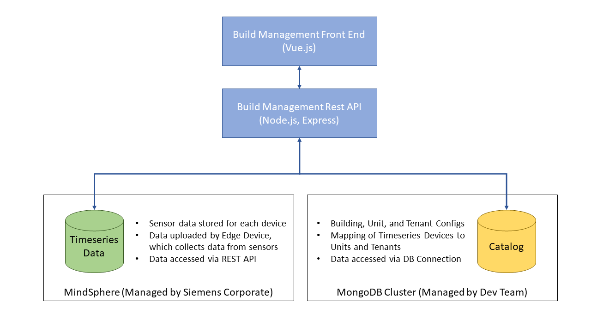

## Overview

The purpose of the Building Management Application was to provide a modernized approach for tenant billing in commerical and residential real estate.  This modernized solution leveraged Siemens power monitoring equipement, such as SEM3 (Siemens Embedded Micro Metering Module), as well as the Siemens cloud platform, MindSphere.

The Building Management Application is the cloud based component to a more complex solution.  The full solution relies on the transfer power monitoring data from energy meters to an edge device.  The edge device aggregates the data into a local database and uploaded the data to the Siemens cloud platform, MindSphere.  MindSphere provides the long term timeseries data storage, as well as a variety of data aggregation API's.  An overview of this data flow can be seen below:  

Once the data is successfully uploaded to MindSphere, the Building Management Application can access the timeseries data (once the proper links are established).  The Building Management Application allows the building owner and/or property manager to build a virtual representation of his/her building(s).  Each virtual building contains multiple virtual units, which can be residential or commercial.  The building owner and/or property manager can then link each unit to a physical device, which is collecting energy data for that unit.  In addition an occupant can be assigned to each unit, which will allow the occupant to see his/her energy data.

Beyond the ability to see near real time data for each unit, the building owner and/or property manager can also specify energy consumption rates.  The Building Management Application will then use these billing rates to automatically generate energy bills for each unit within the building.  By providing these core features, as well as additional supporting features, Siemens was able to provide a turn key solution for tenant billing.

## Application Architecture

